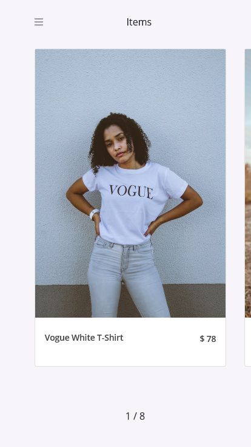
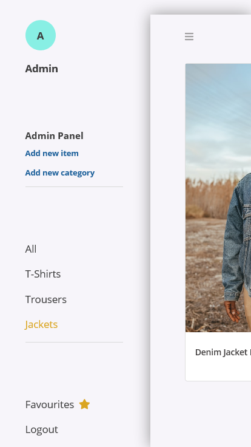
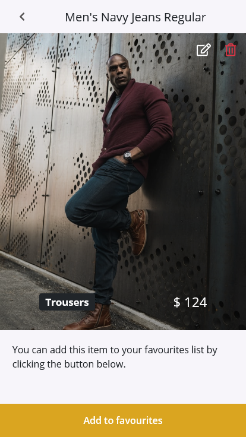

#  Fashion Shop

  Fashion Shop is a Full-stack web application listing items from the backend server with their details.
  It has a very simple authentication system and a few functionalities provided in the admin panel (CRUD operations on items). 
  As a user, you can filter items by category and add them to you your favorites list on the item page.

  This is a mobile web application and not supposed for large screen devices (any viewport width greater than __768px__)

  Design idea belongs to Alexey Savitskiy on [Behance](https://www.behance.net/gallery/37706679/Circle-(Landing-page-Dashboard-Mobile-App))

## Built With 

- CSS Modules,
- React.js
- Redux
- Swiperjs
- Bootstrap

## Screenshots

## Live Demo

[Heroku](https://fashion-shop-front.herokuapp.com/)

## Setup

  If you want to try this application locally, follow the steps below:

  1. Clone the project using `git clone https://github.com/8Bts/fashion-shop.git` command.

  2. run `cd fashion-shop`.

  3. run `npm install`.

  4. run `npm start`.

## Test

  To run tests for the application try the `npm test` command and ensure that you are in the project folder before running it. 

## Author

👤 **Rashid Mammadli**

- Github: [8Bts](https://github.com/8Bts)
- Twitter: [@Rasheed49705929](https://twitter.com/Rasheed49705929)
- Linkedin: [Rashid Mammadli](https://www.linkedin.com/in/rashidmammadli/)
- Email: mcmizze@yahoo.com

## 🤝 Contributing

Contributions, issues, and feature requests are welcome!

Feel free to check the <a href="https://github.com/8Bts/fashion-shop.git/issues" target="_blank">issues page</a>.

## Show your support

Give a ⭐️ if you like this project!

## Acknowledgments

- [Microverse - Web Development School](https://www.microverse.org/)